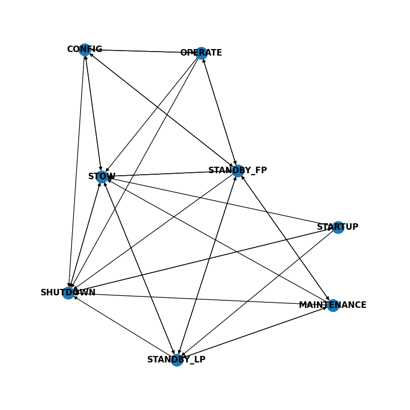

==============
DishMode Model
==============

Every command which transitions the ``dishMode`` is vetted by the component manager using the ``DishModeModel``.
The model has a network of nodes which determine the pre-condition for every mode request command based on
the component state.

The ``DishModeModel`` is an abstraction of the allowed states from a current state (see below) from the `Dish States and Modes ICD`_.

.. image:: ../../images/DishModeTransition.png
  :width: 60%
  :height: 400
  :alt: Dish Mode Transitions

The image below shows ALL the possible mode transitions generated from the ``DishModeModel``
(see README on how to generate the graph).

.. _Dish States and Modes ICD: https://confluence.skatelescope.org/display/SWSI/Dish+States+and+Modes
