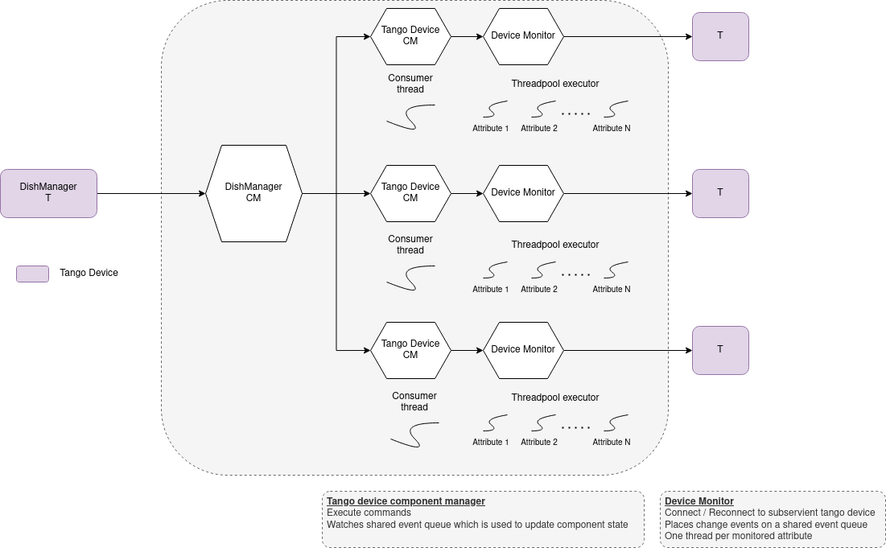
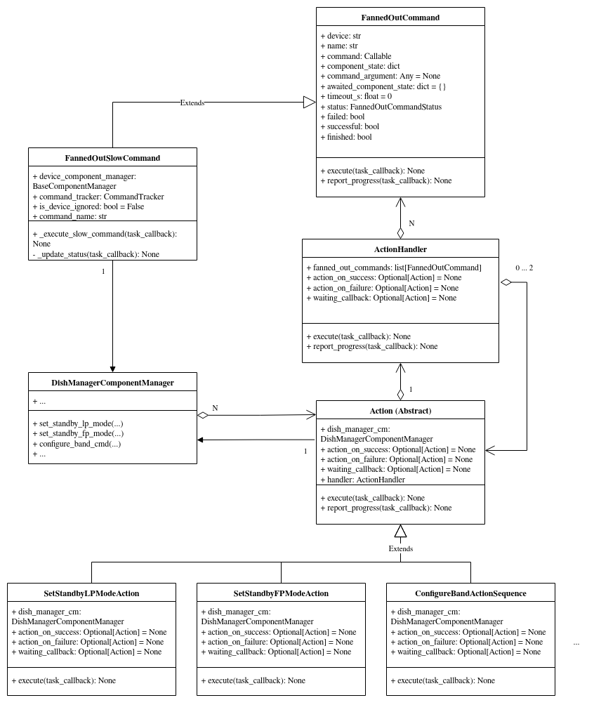

===========================
DishManager Design Overview
===========================

ska-mid-dish-manager is designed and built on ska-tango-base and makes use of its
long running commands to execute dish commands asynchronously. Dish control flows
from TMC through DISH LMC to the respective commands to the subservient devices.
The corresponding commands fanned out to the subservient devices for each command
can be found `here`_. This interaction is managed through component managers
and a model which has transitions rules engine baked into it.

Device Server Design
--------------------

The inheritance diagram below illustrates the high level interaction between DishManager
and the Base Classes and the relationship between the device server and the component manager.  

.. image:: ../images/DishManagerDesign.png
  :width: 100%
  :alt: Dish Manager Design

Component Manager Design
------------------------

The diagram below details the design in the DishManager component manager and how it drives
the sub components using additional specialised component managers.

.. image:: ../images/ComponentManagerDesign.png
  :width: 100%
  :alt: Component Manager Design

Device Monitor Design
---------------------

The diagram below shows how the different component managers are notified of changes on the
sub components using threads monitoring event subscriptions for a number of attributes.

.. _here: https://confluence.skatelescope.org/pages/viewpage.action?pageId=188656205

Command Actions Design
----------------------

The diagram below shows the design of the command Actions which are used to fan out and monitor
sets of commands to subservient devices.

