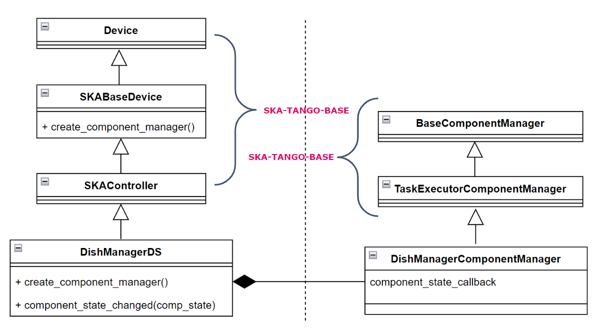
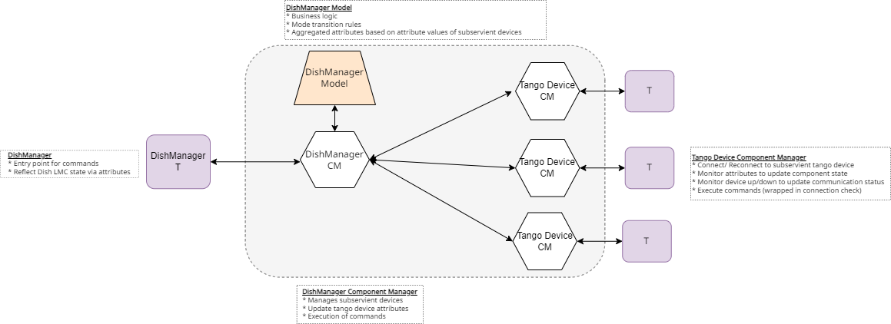

===========================
DishManager Design Overview
===========================

ska-mid-dish-manager is designed and built on ska-tango-base and makes use of its
long running commands to execute dish commands asynchronously. Dish control flows
from TMC through DISH LMC to the respective commands to the subservient devices.
The corresponding commands fanned out to the subservient devices for each command
can be found `here`_. This interaction is managed through component managers
and a model which has transitions rules engine baked into it.

Device Server Design
--------------------

The inheritance diagram below illustrates the high level interaction between DishManager
and the Base Classes and the relationship between the device server and the component manager.  

Component Manager Design
------------------------

The diagram below details the design in the DishManager component manager and how it drives
the sub components using additional specialised component managers.

Device Monitor Design
---------------------

The diagram below shows how the different component managers are notified of changes on the
sub components using threads monitoring event subscriptions for a number of attributes.

.. image:: ../images/DeviceMonitorDesign.png
  :width: 100%
  :alt: Device Monitor Design

.. _here: https://confluence.skatelescope.org/pages/viewpage.action?pageId=188656205

Command Actions Design
----------------------

The diagram below shows the design of the command Actions which are used to fan out and monitor
sets of commands to subservient devices. Each action defines a handler that consists of 1 or more
FannedOutCommand objects, and may include optional on_success and on_failure callbacks to enable
chaining of actions.

The FannedOutCommand class encapsulates the logic and metadata for an individual command running on
a subservient device, whereas, the ActionHandler class contains the logic to coordinate and monitor
a list of FannedOutCommand objects.

Each fanned out command will wait for an attribute update from the subservient device while the
ActionHandler will wait for an aggregated attribute update on the DishManager device.

The FannedOutSlowCommand is an implementation of the FannedOutCommand which is more Tango focused
and is coupled to the SKA BaseComponentManager and CommandTracker classes.

The Action class can be extended to define concrete Actions with their list of fanned out commands,
awaited component states, handlers, and any specific behavior. These actions are then used by the
DishManagerComponentManager to execute desired actions.

For example, the SetStandbyLPMode Action consists of 3 fanned out commands:
- SPF.SetStandbyLPMode
- SPFRx.SetStandbyMode
- DS.SetStandbyMode

The DishManager ConfigureBand<N> commands are defined as the following sequence of Actions, in
order:
- SetStandbyFPModeAction (if the current dish mode is DishMode.STANDBY_LP)
- ConfigureBandAction
- SetOperateModeAction (if the current dish mode is NOT DishMode.STOW)

.. image:: ../images/DishManagerActionsDesign.png
  :width: 100%
  :alt: Command Actions Design
