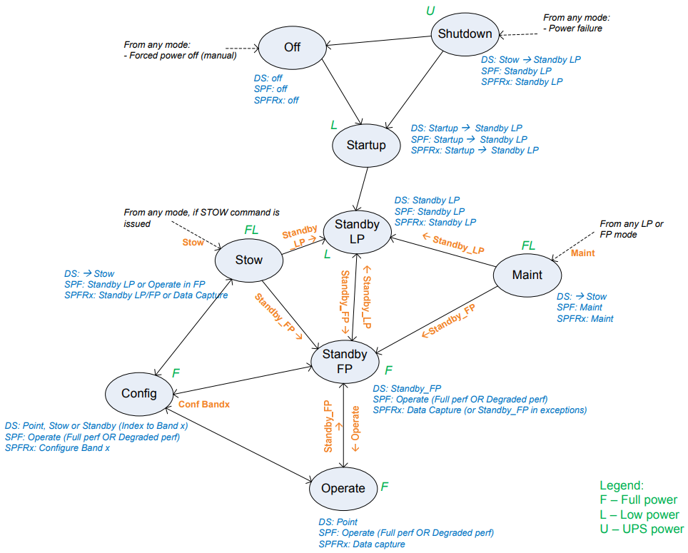

==============
DishMode Model
==============

Every transition is managed by DishManager's component manager through the model.
The model has a dish mode transition network working with a rules engine working to specify:

* the allowed modes Dish has to be in to execute a command.
* the respective values the attributes in the underlying devices should report to
  reflect a particular value on the aggregated attributes on Dish.

The dish mode transition diagram from the `Dish States and Modes ICD`_ summarises
the transitions with their pre and post-conditions detailed in the `command fanout page`_. 
All the mode transitions are abstracted in the dish `DishModeModel`.

.. note::
  OFF is no longer a mode transitioned from.

The sequence diagram below illustrates the transition to STANDBY_LP DishMode showing the sequence of
events that take place (i.e. pre-condition, trigger, event and post-condition).

.. uml:: setstandbyfp_sequence_diagram.uml
.. uml:: command_map_sequence_diagram.uml

.. note::
  Sequence diagram takes into account changes in ADR-93. 

.. _Dish States and Modes ICD: https://confluence.skatelescope.org/display/SWSI/Dish+States+and+Modes
.. _command fanout page: https://confluence.skatelescope.org/pages/viewpage.action?pageId=188656205
