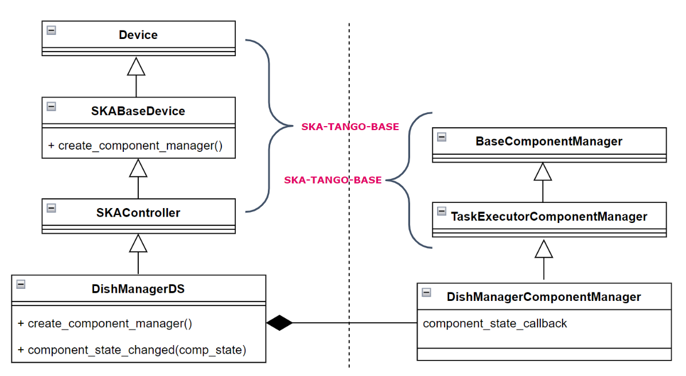
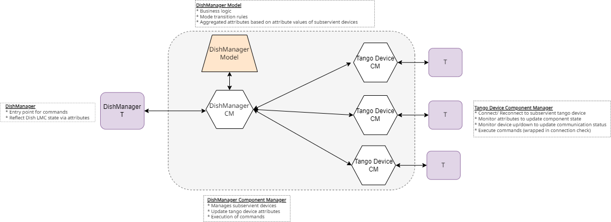
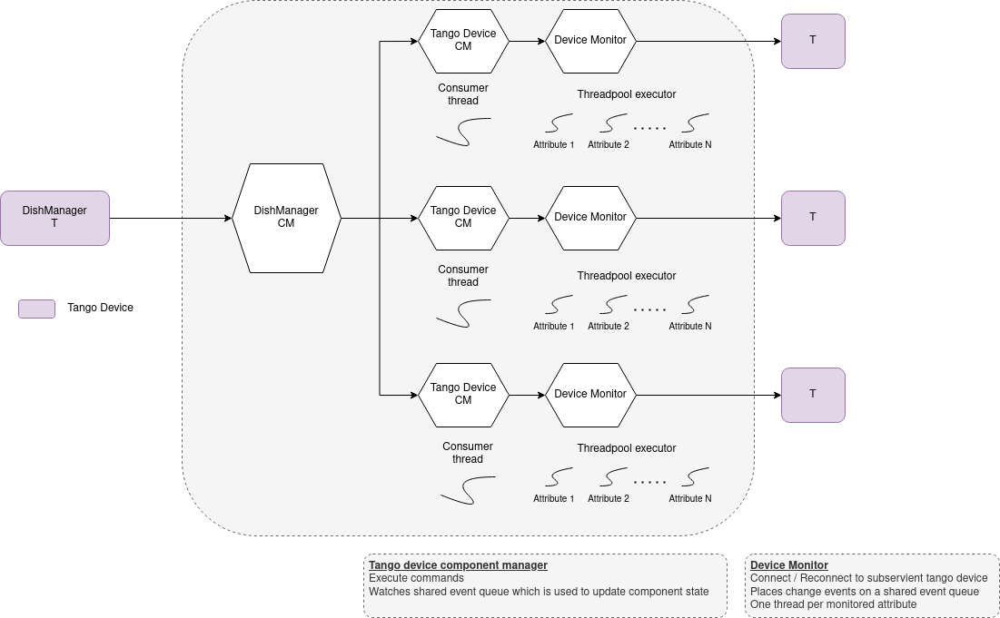

===========================
DishManager Design Overview
===========================

ska-mid-dish-manager is designed and built on ska-tango-base and makes use of its
long running commands to execute dish commands asynchronously. Dish control flows
from TMC through DISH LMC to the respective commands to the subservient devices.
The corresponding commands fanned out to the subservient devices for each command
can be found `here`_. This interaction is managed through component managers
and a model which has transitions rules engine baked into it.

Device Server Design
--------------------

The inheritance diagram below illustrates the high level interaction between DishManager
and the Base Classes and the relationship between the device server and the component manager.  

Component Manager Design
------------------------

The diagram below details the design in the DishManager component manager and how it drives
the sub components using additional specialised component managers.

Device Monitor Design
---------------------

The diagram below shows how the different component managers are notified of changes on the
sub components using threads monitoring event subscriptions for a number of attributes.

Testing
-------

Since the component managers manage the interactions with the devices, we are
able to check the robustness of our component manager and the business rules
captured in our model without spinning up any tango infrastructure. These
unit tests are captured in the ``python-test`` job. Additionally, the device
server interface is tested (using a DeviceTestContext) without having to set up 
client connections to the sub components. The necessary triggers on the sub 
components needed to effect a transition on DishManager are manipulated from
weak references to the sub component managers. 

The final level of testing runs with all live tango devices, to test the entire
chain from events to callbacks on the various component managers down to the
DishManager device server attribute. These tests use `simulated devices`_
with limited api and functionality for the ``SPF Controller``, ``SPFRx Controller``
and the ``DS Simulator``. These acceptance tests are captured in the ``k8-test`` job.

.. _here: https://confluence.skatelescope.org/pages/viewpage.action?pageId=188656205
.. _simulated devices: https://gitlab.com/ska-telescope/ska-mid-dish-simulators
