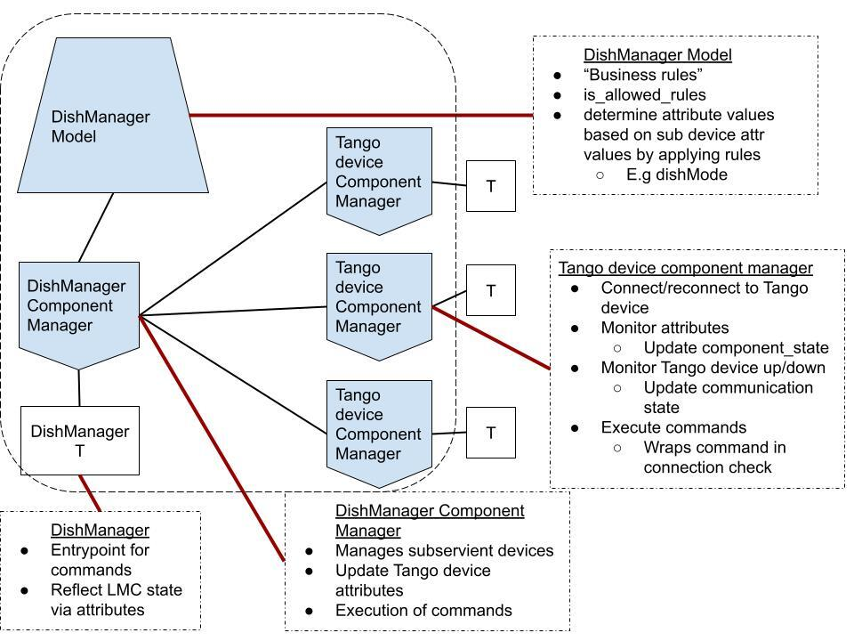

===========================
DishManager Design Overview
===========================

This is a walkthrough on the design and implementation of the dish manager
using Long Running Commands from ska-tango-base. The DishManager receives
commands from TMC MID and then sends the respective commands to the subservient
devices. The corresponding commands cascaded to the subservient devices for each
command can be found `here`_. This interaction is managed through the component
managers of the DishManager through the model and a rules engine and finally to
the subservient devices through their component managers.

See image below summarising the design behind the DishManager implementation:

Testing
-------

Since the component managers manage the interactions with the devices, we are
able to check the robustness of our DishManager device and the business rules
captured in our model without spinning up any tango infrastructure. These unit
tests are captured in the `python-test` job.

In addition, there are tests in the pipeline which run against live tango
devices, especially for the events and reporting of attributes. For this
purpose, dummy devices with limited api and functionality for `SPF`, `SPFRx` and
`DS` devices. These acceptance tests are captured in the `k8-test` job.

.. _here: https://confluence.skatelescope.org/pages/viewpage.action?pageId=188656205