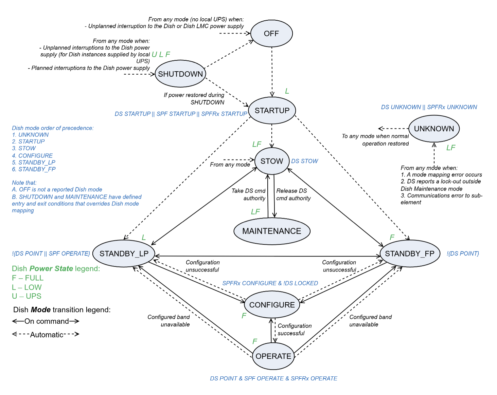
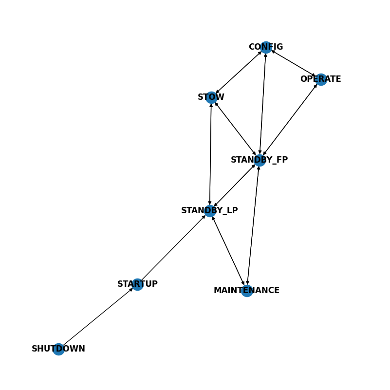
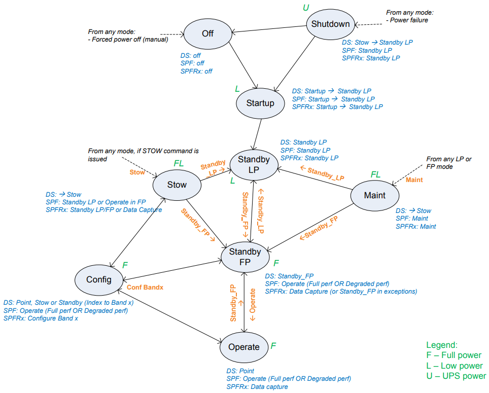

=================
DishManager Model
=================

Every transition is managed by DishManager's component manager through the model.
The model has a mode transition network and rules engine working together to specify:

* the allowed modes Dish has to be in to execute a command.
* the respective values the attributes in the underlying devices should report to
  reflect a particular value on the aggregated attributes on Dish.

The image below is a dishMode transition diagram showing **ALL** possible mode
transitions generated from the DishModeModel.

The dish mode transition diagram in the `Dish States and Modes ICD` captures
less interactions with annotations for easier comprehension. A miniature graph
from the graph above has been added for easy comparison with the diagram from 
the ICD.

.. note::
  OFF is no longer a mode transitioned from. This is why it's not in the
  generated model.
