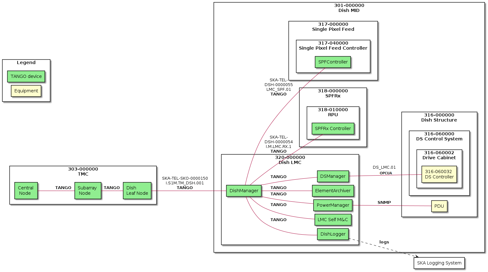

==================================
SKA Mid Dish Manager Documentation
==================================

Description
-----------

This device provides master control and rolled-up monitoring of dish. When
commanded, it propagates the associated command to the relevant sub-systems
and updates its related attributes based on the aggregation of progress
reported by those sub-systems. It also exposes attributes which directly
relate to certain states of the sub-systems without making a proxy to
those sub-element devices.

.. toctree::
  :maxdepth: 1

   Developer Guide<developer_guide/index>
   User Guide<user_guide/index>
   API<api/index>
   CHANGELOG<CHANGELOG>

Indices and tables
==================

* :ref:`genindex`
* :ref:`modindex`
* :ref:`search`
