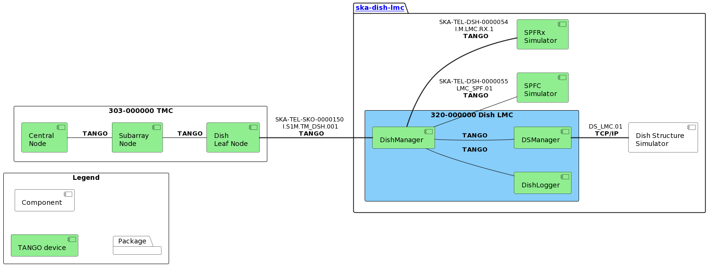

==================================
SKA Mid Dish Manager Documentation
==================================

Description
===========

This device provides master control and rolled-up monitoring of dish. When commanded, it propagates the associated command to the relevant sub-elements and updates its related attributes based on the aggregation of progress reported by those sub-elements. It also exposes attributes which directly relate to certain states of the sub-elements without making a proxy to those sub-element devices.

.. toctree::
   :maxdepth: 2
   :caption: Contents:

Indices and tables
==================

* :ref:`genindex`
* :ref:`modindex`
* :ref:`search`
