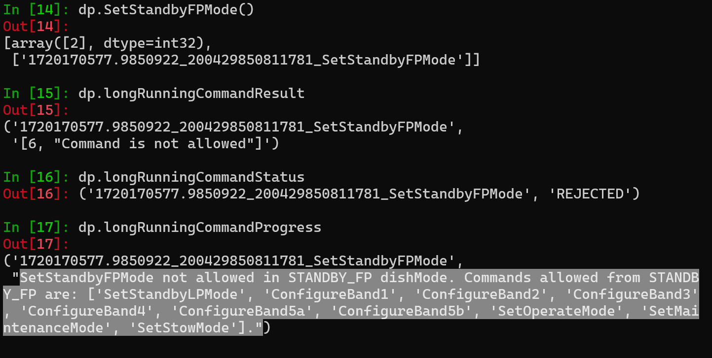

===============
Getting started
===============
This page will guide you to explore a running DishManager interface.

Prerequisites
-------------
It is assumed here that you have `set up your development environment`_
and a :doc:`deployed instance of DishManager <how_to>` with the simulators.

[Move to DISH_LMC docs] Or you are connecting to a deployment in one of the
integration environments using `manual jobs in the GitLab pipeline`_.

Explore DishManager Interface from Client
^^^^^^^^^^^^^^^^^^^^^^^^^^^^^^^^^^^^^^^^^
A tango device proxy will be used to drive control and perform monitoring
on the deployed server. From the client, the DishManager device server interface
can be explored using tango attributes, properties and commands. The detailed interface
can be found in the :doc:`API section <../api/devices/dish_manager_interface>`.

**Explore Attributes and Commands**

.. tabs::

   .. tab:: interface using itango 

      .. code-block:: rst

         In [1]: dish_manager = DeviceProxy("ska001/elt/master")

         # ensure that the device is reachable
         In [2]: dish_manager.ping()
         Out[2]: 726
         
         In [3]: dish_manager.get_attribute_list()
         Out[3]: [a list of all the attributes]

         In [4]: dish_manager.get_command_list()
         Out[4]: [a list of all the commands]

         # this will produce a snapshot of the state of the subservient
         # devices. it is a custom commands used mosstly for debugging.
         In [5]: print(dish_manager.GetComponentStates())

         # on startup, dish manager reports STANDBY_LP
         In [6]: dish_manager.dishMode
         Out[6] <DishMode.STANDBY_LP: 2>

.. tip:: All commands begin with uppercase and for attributes, lowercase. However, the client
   can call a command or read an attribute in any case so long as that name exists on the server's interface.

**Dish Control and Monitoring**

Since DishManager fans out commands to sub devices which in turn execute over a relatively "long"
period, most of the commands are implemented to run asynchronously. The progress of a command can
be tracked on `dedicated attributes`_ which have a ``longrunningcommand_`` suffix (this is in 
addition to the attribute which will report the final state of the Dish).

The specific attribute(s) which is updated for each command is :ref:`tabulated below <tabulated-commands-and-attributes>`.
Event subscription will be used to monitor progress on the dishMode and configuredBand transitions in this example.

.. tabs::

   .. tab:: monitoring and control in itango 

      .. code-block:: rst

         In [1]: cb = tango.utils.EventCallback()
            ...: subscription_id = dish_manager.subscribe_event("longrunningcommandprogress", tango.EventType.CHANGE_EVENT, cb)
         
         # request to go to STANDBY_FP, response is a result code and unique id
         In [2]: dish_manager.SetStandbyFPMode()
         Out[2]: [array([2], dtype=int32), ['1701377289.3152518_92664672841537_SetStandbyFPMode']]

         # monitor the events and look out for a message indicating the
         # command has completed and check dish mode is STANDBY_FP
         In [3]: dish_manager.dishMode
         Out[3] <dishMode.STANDBY_FP: 3>

         # configure a freq band (only 1 and 2 supported at the moment)
         In [4]: dish_manager.ConfigureBand2(True)
         Out[4]: [array([2], dtype=int32), ['1701377495.333358_33114815365266_ConfigureBand2']]

         # check band is B2 after events show command completed
         In [5]: dish_manager.configuredBand
         Out[5] <configuredBand.B2: 2>

         # request FP again (illegal transition)
         In [6]: dish_manager.SetStandbyFPMode()
         ERROR (see image below)

.. tip:: There is a :doc:`list of transition rules <../api/models/transition_rules/index>` for the
   various attributes which determine what the final state of the dish (it's based on what
   the sub components are reporting). This is where the custom command ``GetComponentStates``
   is especially useful.

.. _tabulated-commands-and-attributes:

**Commands and updated attributes**

+---------------------+----------------------------------------+
| Commands            | Attributes to watch                    |
+=====================+========================================+
|| SetStandbyLPMode   || dishMode                              |
|| SetStandbyFPMode   ||                                       |
|| SetOperateMode     ||                                       |
+---------------------+----------------------------------------+
|| SetStowMode        || dishMode, desiredPointing,            |
|| SetMaintenanceMode || achievedPointing                      |
+---------------------+----------------------------------------+
|| ConfigureBand      || configuredBand                        |
|| [1,2,3,4,,5a,5b]   || dishMode (transient change to CONFIG  |
||                    || and back to previous mode)            |
+---------------------+----------------------------------------+
| SetKValue           | kValue                                 |
+---------------------+----------------------------------------+
|| Scan               || pointingState, desiredPointing,       |
|| Slew               || achievedPointing, achievedTargetLock, |
|| Track              ||                                       |
+---------------------+----------------------------------------+
| TrackStop           | pointingState                          |
+---------------------+----------------------------------------+
| TrackLoadStaticOff  | N/A                                    |
+---------------------+----------------------------------------+

.. _set up your development environment: https://developer.skatelescope.org/en/latest/tools/tango-devenv-setup.html
.. _dedicated attributes: https://developer.skao.int/projects/ska-tango-base/en/latest/guide/long_running_command.html
.. _manual jobs in the GitLab pipeline: https://gitlab.com/ska-telescope/ska-dish-lmc/-/pipelines
