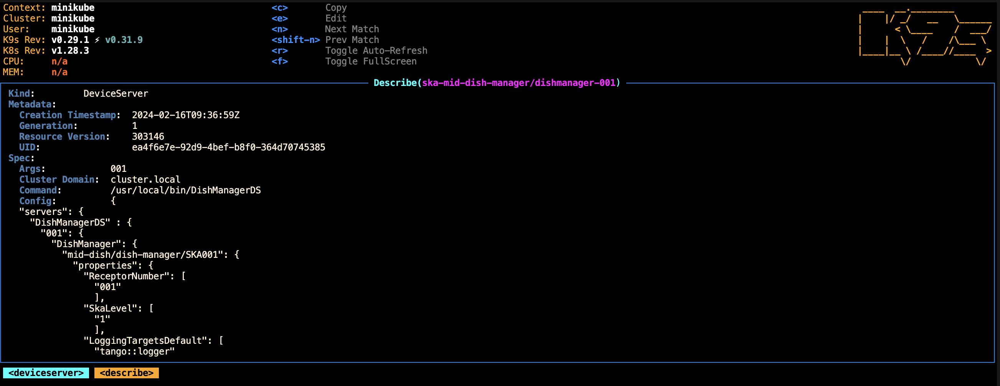

======
How to
======
This page will guide you through the steps to deploying DishManager
along with the simulators locally. It is assumed here that you have cloned the
``ska-mid-dish-manager`` repository, and have `set up your development environment`_. 

Deploy DishManager with Simulators
^^^^^^^^^^^^^^^^^^^^^^^^^^^^^^^^^^

1. Deploy ska-tango-operator to manage the pods and their configuration.

.. tabs::

   .. tab:: ska-tango-operator chart deployment

      .. code-block:: console

        $ git clone git@gitlab.com:ska-telescope/ska-tango-operator.git
        $ cd ska-tango-operator
        $ make k8s-install-chart

2. Deploy ska-mid-dish-manager from the chart

.. tabs::

   .. tab:: ska-mid-dish-manager chart deployment

      .. code-block:: console
        
        $ cd ska-mid-dish-manager
        $ K8S_CHART_PARAMS='--values charts/ska-mid-dish-manager/custom_helm_flags.yaml' make k8s-install-chart
        $ # alternatively, you can use the helm command directly
        $ helm upgrade --install test charts/ska-mid-dish-manager -n dish-manager -f charts/ska-mid-dish-manager/custom_helm_flags.yaml

1. Advanced: Deploy ska-mid-dish-manager from your repository

.. tabs::

   .. tab:: ska-mid-dish-manager as a chart dependency

      Assumption: `templates repository`_ is used to manage your deployment.

      The ska-mid-dish-manager chart can be added as a chart dependency in your own repository
      to include it as part of your own deployment process. This will also require setting some
      additional configuration in your values file.

      .. code-block:: rst
         
         # in chart.yaml
         ...
         - name: ska-mid-dish-manager
         version: x.x.x
         repository: https://artefact.skao.int/repository/helm-internal

         - name: ska-mid-dish-simulators
         version: x.x.x
         repository: https://artefact.skao.int/repository/helm-internal
         condition: ska-mid-dish-simulators.enabled

      .. code-block:: rst
         
         # in your custom values.yaml
         ...
         ska-mid-dish-manager:
         enabled: true

         ska-mid-dish-simulators:
         enabled: true
         deviceServers:
            spfdevice:
               enabled: true
            spfrxdevice:
               enabled: true
         dsOpcuaSimulator:
            enabled: true

         ska-mid-dish-ds-manager:
         enabled: true

         ska-mid-wms:
            enabled: true
            ska-tango-base:
               enabled: false
               itango:
                  enabled: false
            deviceServers:
               wms:
                  enabled: true
                  station_ids: ["1"]
                  modbus_server_hostnames: ["wms-sim-1"]
                  modbus_server_ports: ["1502"]
            simulator:
               enabled: True

      .. note:: Tango DB is not deployed by default, to deploy it add ``--set ska-tango-base.enabled=true``
         if it's not part of your existing deployment. Also, use ``false`` for the global operator
         flag if you're not making use of the ska tango operator in your repository.

The deployment will constitute pods for:

* Tango DB
* DishManager
* DSManager
* Simulators: SPF, SPFRx & OPCUA server
* WeatherMonitoringSystem (WMS) and WMS simulator server 

All these pods have to be up in the ``ska-mid-dish-manager`` namespace to have a
fully functional software to interact. The pod of particular interest will be
``ds-manager-001-0``. The device name which connects to the DishManager server is
``mid-dish/dish-manager/SKA001``: this may change, and can be looked up in the deployment on
the ``deviceserver`` namespace by inspecting the ``Config`` value on the
``dishmanager-001`` pod (see the image below).

Manage your Deployment
^^^^^^^^^^^^^^^^^^^^^^
A deployment constitutes a number of running pods, with each deployed pod
exposing a running tango device. kubectl commands can be used to manage your
deployment; however using `k9s`_ to manager your cluster deployment is very
efficient and time saving. Having an additional (sandbox) pod to in the cluster
to drive the control and monitoring is also essential.

There's an `example configuration file`_ which can be used to deploy an
additional pod in the cluster. To use it run the kubectl command below and
itango from the pod's shell.

.. tabs::

   .. tab:: deploy sandbox

      .. code-block:: console
        
        $ kubectl apply -f sandbox.yaml
        $ itango3

The sandbox pod can be killed using ``Ctrl + k``.

.. note:: Deploy DishManager before running itango on the sandbox pod to avoid database connection errors

.. tabs::

   .. tab:: tear down DishManager

      .. code-block:: console
        
        $ cd ska-mid-dish-manager
        $ make k8s-uninstall-chart

   .. tab:: tear down tango operator

      .. code-block:: console
        
        $ cd ska-tango-operator
        $ make k8s-uninstall-chart

.. _set up your development environment: https://developer.skatelescope.org/en/latest/tools/tango-devenv-setup.html
.. _k9s: https://github.com/derailed/k9s
.. _example configuration file: https://gitlab.com/ska-telescope/ska-mid-dish-manager/-/blob/main/charts/sandbox.yaml?ref_type=heads
.. _templates repository: https://gitlab.com/ska-telescope/templates-repository
.. _extra variables: https://gitlab.com/ska-telescope/ska-mid-dish-manager#deploy-the-chart-with-simulators
